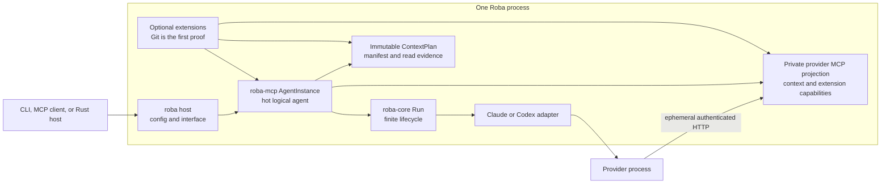

# Roba architecture

This document is the navigation map for Roba's shipped architecture. It
explains which layer owns each decision, how one operation moves through the
system, and which boundaries must remain explicit.

For installation and everyday use, start with the [README](README.md). For
exact command syntax, use `roba --help`. The
[documentation map](docs/README.md) indexes detailed contracts and each
crate's Rustdoc.

## System in one page

Roba is an MCP-native harness for one logical coding agent:

- `roba-core` executes one finite, provider-neutral run.
- `roba-context` validates the data-oriented managed-context catalog.
- `roba-mcp` retains one logical agent across finite runs and exposes typed
  MCP projections.
- the root `roba` package resolves startup policy and supplies the `init`,
  `run`, `serve`, `config`, and `completions` commands.
- optional extensions add scoped MCP capabilities, context, and lifecycle
  observation above the core.
- Claude Code and Codex remain external provider processes launched through
  built-in adapters.

One hot agent has at most one active operation. One operation may contain
several provider turns when follow-ups are queued, but it still owns one
finite core lifecycle and one terminal result. Provider processes are not
kept warm between operations, but a validated opaque provider session handle
may be retained.

An `McpRouter` is a role-specific view of an agent, not the identity or state
of the agent itself. Fresh routers may share one `AgentInstance` without
creating a pool or multi-agent server.

## Layers and ownership

| Layer | Owner | Primary contract |
| --- | --- | --- |
| Command host | root `roba` package | Config, CLI, stdio, and signals |
| Hot agent | `roba-mcp` | `AgentInstance`, MCP, context, and extensions |
| Managed catalog | `roba-context` | Agent, skill, and prompt definitions |
| Finite run | `roba-core` | Runs, providers, outcomes, and events |
| Provider adapter | `roba-core::providers` | Claude/Codex process mapping |
| Optional Git | `roba-git` | One fixed-workspace MCP extension |
| Machine boundary | `roba-types` | Envelopes and exit-code constants |

The command host does not define provider execution or MCP schemas.
`roba-mcp` does not construct provider commands or hide a durable queue.
`roba-core` does not depend on Tower MCP, transports, persistent agent state,
or repository policy. Provider adapters do not own hot-agent policy or router
composition. `roba-git` cannot select arbitrary repositories or grant provider
authority.

The Claude and Codex wrapper crates are reusable process boundaries below the
adapters. Tower MCP is the protocol implementation below `roba-mcp`. Neither
external API is allowed to define Roba's provider-neutral public model.

## Interfaces and lifetimes

### `roba init`

`roba init` renders one conservative versioned startup file, validates it
through the same strict schema and managed catalog resolver as `run` and
`serve`, and installs it atomically without replacing any recognized sibling
configuration. The default preserves provider-native ambient context and
read-only authority. Managed agent, skill, and prompt IDs are opt-in.

`--dry-run` emits the exact validated TOML without touching the workspace.
Initialization never launches a provider. `roba config survey` builds the
separate, versioned input packet for model-assisted tuning: safe startup state,
content-free context evidence, and a fixed nonrecursive inventory of recognized
project markers. It reads no file bodies, starts no provider, and writes
nothing.

`roba config propose` proves the next provider-assisted boundary without
granting configuration-write authority. It launches one fresh, read-only,
controlled-context operation with no optional extension authority. The survey
is a mandatory generation-fenced context entry, and the provider must submit
one strict candidate through an operation-local `config.propose` MCP tool.
Roba validates built-in catalog references and renders canonical TOML itself.
The result is preview-only; semantic merging and application remain later
policy.

### `roba run`

`roba run` resolves a suspended agent template, constructs an
`AgentInstance`, connects to its control router through Tower MCP's in-process
channel transport, and makes one synchronous `agent.turn` call. The CLI then
projects the typed terminal result back to plain stdout or the versioned JSON
envelope and exits.

This means the finite CLI path exercises the same MCP tool contract as other
clients without exposing an external listener.

### `roba serve`

`roba serve` constructs the same fixed agent template but hosts the control
router over stdio. It starts promptless and launches no provider until a turn
is admitted. The host remains idle between operations, retains valid provider
session evidence, and permits synchronous calls or MCP Tasks.

Requests dispatch concurrently so state and event reads, follow-up,
interruption, and shutdown can overtake a long turn. Stdio EOF and host signals
are bridged to logical shutdown, while an `agent.shutdown` response is allowed
to flush before transport exit.

### Private provider endpoint

Every admitted operation binds a separate authenticated IPv4 loopback MCP
endpoint. The provider process uses it to read Roba-managed context and call
explicitly approved extension capabilities. This is launch plumbing, not an
operator-facing HTTP service.

The listener, bearer credential, operation fence, and approved tool list are
transient launch context. They never enter `RunSpec`, snapshots, events, or
public context manifests. The endpoint is revoked and drained before terminal
settlement becomes visible.

General shared operator HTTP and Unix-socket bindings are not shipped. Their
lifetime, authentication, and multi-client contract is tracked in
[#520](https://github.com/joshrotenberg/roba/issues/520).

## Primary operation flow

One admitted operation follows this path:

1. The root host discovers and validates versioned startup configuration,
   applies explicit CLI overrides, registers providers, and constructs enabled
   extensions.
2. `AgentInstance` preflights both MCP projections, compiles extension context
   into one immutable `ContextPlan`, and validates the suspended `RunSpec`.
3. `agent.turn` admits work only if the logical agent is open and idle. It
   allocates an exact operation ID and applies operation-local model, effort,
   and limit overrides.
4. The host starts the private provider endpoint, compiles the minimal context
   bootstrap, and creates one core `Run` with non-serializable launch context.
5. The selected provider adapter launches the provider process. The core
   lifecycle owns provider turns, normalized events, queued follow-ups,
   timeout, cancellation, and terminal state.
6. `roba-mcp` fans core events into one bounded agent-wide journal, records
   provider activity and context reads, and runs exact-operation extension
   hooks outside the agent control lock.
7. Settlement drains the provider, private endpoint, context reads, and
   extension hooks before publishing the final operation result and returning
   the logical agent to idle.
8. The initiating interface renders or retains the typed result. A provider
   failure does not stop a hot agent.

`agent.follow_up` does not inject text into a provider process that is already
thinking. It adds a prompt to a bounded FIFO for the exact active operation.
After the current provider turn finishes, the core resumes the provider
session with the oldest queued prompt. The original call or Task settles only
after the queue empties or the operation fails or is cancelled.

## Finite core contract

`RunSpec` contains provider-neutral executable intent:

- `AgentSpec`: provider, optional model and effort, and explicit instructions;
- `ContextSpec`: explicit project and run context;
- `ExecutionSpec`: permissions, tool policy, limits, and fresh or resumed
  session intent;
- optional initial `Prompt`: present for a ready run and absent for a
  suspended template.

`Roba` is a provider registry and run factory. `RunHandle` exposes start,
status, bounded event replay/subscription, follow-up, cancellation, and wait.
The finite states are `suspended`, `ready`, `running`, `finishing`,
`completed`, `failed`, and `cancelled`.

The lifecycle, not a provider adapter, synthesizes authoritative state and
turn-boundary events. Providers may emit only provider-owned output, usage,
warning, and activity evidence. Provider panics and abnormal driver exit become
typed failures rather than wedging a run.

## Hot-agent state and MCP contract

`AgentInstance` owns:

- one immutable suspended `RunSpec` template;
- one selected provider and authority posture;
- zero or one validated provider session handle;
- one immutable session policy and monotonic session generation;
- zero or one active finite `RunHandle`;
- one immutable context plan and operation-scoped read evidence;
- one bounded, globally sequenced agent event journal;
- one immutable extension aggregate;
- open, stopping, or stopped host lifetime.

The base control projection exposes:

- `agent.turn` for single-flight admission;
- `agent.follow_up` for a bounded next-boundary prompt;
- `agent.interrupt` for exact-operation cancellation and settlement;
- `agent.session.rotate` for idle, generation-fenced clean rotation;
- `agent.shutdown` for permanent admission closure and draining;
- `roba://agent` for redacted configuration, current state, timing, session
  policy, generation, availability, provider-turn count, and observation;
- `roba://events{?after,limit}` for bounded replay;
- `roba://context` and `roba://context/entry{?id,generation}` for declared
  context and explicit content reads.

A concurrent turn receives a typed `busy` refusal. The base harness contains
no hidden queue. Controls require the exact operation ID so a delayed client
cannot act on later work.

Provider and domain failures are valid MCP tool exchanges with typed
`structuredContent` and `isError: true`. JSON-RPC errors are reserved for
malformed protocol input, missing capabilities, authorization failures, and
server faults. Machine clients must not infer result semantics from display
text.

Task cancellation targets the operation captured at Task preparation and
drains it before terminal Task settlement. Dropping a direct synchronous
waiter does not own or cancel an admitted operation; explicit interruption,
shutdown, timeout, or natural completion does.

## Authority and projections

Roba separates execution authority from prompt content. A prompt can request
an action but cannot grant read, write, process, transport, or extension
authority.

The provider-neutral permission postures are:

- `read_only`;
- `workspace_write`;
- `full_auto`, which permits unattended provider behavior and is intended for
  use inside an external sandbox.

Each adapter maps these postures explicitly and rejects unsupported authority.
Codex keeps both writable postures inside its workspace-write sandbox rather
than mapping `full_auto` to danger-full-access.

The control projection is the operator surface. The provider projection is a
new allowlist-built router for one exact operation. Its base capabilities are
the read-only `self`, `context.manifest`, and `context.read` tools plus the
equivalent context resources. It structurally excludes turn admission,
follow-up, interruption, shutdown, configuration, prior results, event
history, Tasks, and retained session evidence.

Provider adapters approve only exact advertised MCP tool names. Approval is
not authorization: anything the provider must not call is absent from its
router, not merely hidden from discovery or omitted from an allowlist.

## Context and evidence

Context is an immutable typed plan, not a concatenated universal prompt. The
shipped plan inventories explicit adapter context, the fixed bootstrap, and
extension contributions. Its intended semantic vocabulary grows into this
ordered stack:

1. the fixed minimal Roba bootstrap describing operation identity, authority,
   current-goal delivery, and context acquisition;
2. an optional selected agent role;
3. small extension activation entries;
4. zero or more discoverable skills;
5. the operation directive;
6. dynamic MCP resources containing current facts.

`roba-context` owns the strict, bounded data catalog for agent roles, skills,
and reusable prompts. The root host now loads built-in and configured inline
or repository-local Markdown definitions, records content-free provenance and
fingerprints, and computes an optional deterministic selection during startup.
The selected agent and transitive skills compile through the ordinary
`AgentExtension` path into generation-fenced context entries. Only the agent
is mandatory; skills remain lazy. Enabled reusable prompts are operator-only
MCP prompts rendered by the catalog itself. The content-free catalog and
explicit operator artifact reads are MCP resources, while the provider sees
only selected context through `context.manifest` and `context.read`. The
current `agent.turn` directive remains separate from standing context.

Today, explicit `AgentSpec.instructions` and `ContextSpec` values are still
delivered by provider adapters on every provider turn. Extension context joins
the same `ContextPlan` but remains lazy MCP material and is not appended to
`RunSpec` or provider prompts. The minimal launch bootstrap points the provider
to the manifest and required acquisitions without copying their bodies.

The content-free manifest records stable IDs, semantic kind, origin,
precedence, phase, scope, audience, delivery, freshness, requirement,
sensitivity, and safe fingerprints. Bodies stay in host memory and require an
explicit generation-fenced read. Operator-only entries are structurally absent
from the provider projection.

Roba distinguishes planned, available, read, acknowledged, and followed
context. Only provider-side MCP reads are mechanically recorded today. A read
does not prove model acknowledgement or compliance.

Before an agent host is constructed, Roba deterministically lints the declared
plan. Typed warnings identify duplicate safe fingerprints, bounded directive
and authority conflicts, repeated stable delivery, and excessive eager
material. Unsafe locators and unavailable required deliveries fail before
endpoint binding or provider launch. Diagnostics expose only IDs, safe
provenance, fingerprints, and byte counts; they never include bodies, secrets,
or raw locators. The same findings appear in `roba://context` and
`roba config effective`, but are not mixed into turn results.

Provider-native ambient context is a separate and only partially observable
layer. `ambient` preserves normal provider discovery. `controlled` applies a
tested adapter-specific reduction and publishes the exact retained,
suppressed, and unobservable source classes in `roba://context`. Unsupported
policies fail during host construction. Neither built-in adapter claims
`hermetic`: provider baselines, managed policy, or other native sources remain
outside Roba's complete control.

## Extensions

`AgentExtension` is the additive application-layer contribution API. One
extension may provide:

- control and provider MCP router fragments;
- an exact manifest of provider-callable tools;
- retained or externally available context entries;
- one exact-operation lifecycle observer.

`AgentExtensions` preflights control and provider projections with fail-closed
`try_merge` semantics. An extension cannot replace base tools, resources,
templates, prompts, or context IDs. Provider capabilities are opt-in; control
capabilities are never mirrored automatically.

Lifecycle observers may run at admission, start, periodic tick, settlement,
final state, and host shutdown. Hooks are serialized per extension, bounded by
a host timeout, run outside the agent control lock, and drain before terminal
settlement. Their compact change evidence enters the agent journal; complete
extension state belongs in extension-owned MCP resources.

`roba-git` proves the model. It captures one repository at construction,
publishes read-only snapshots and cached operation progress to both
projections, and keeps `git.stage_all` in writable control projections only.
Git state is read on demand rather than injected into provider prompts.

## State, events, and settlement

Core run events are bounded and cursor-addressed. The MCP layer adds a second
bounded journal whose sequence continues across finite operations while
retaining each source-run sequence and operation ID. Falling behind is an
explicit truncation condition, never silent completeness.

Provider adapters normalize only mechanically observed activity such as
commands, file changes, MCP calls, web searches, plans, status, tool calls, and
unknown events. Roba reports timing and observation health but never invents
progress percentages or hidden reasoning.

Terminal settlement is an evidence boundary. Completed, failed, and cancelled
results have variant-specific typed payloads. Cancellation and shutdown drain
provider work, process groups, private endpoints, extension callbacks, and
event publication before the agent reports reusable idle or permanent stopped
state.

## Startup configuration

The root host owns one strict, versioned startup contract shared by `run` and
`serve`. It layers the user/XDG file, project files from the effective cwd to
the Git root, and explicit CLI values. Unknown fields, ambiguous sibling files,
unsupported versions, invalid values, and unenforceable provider controls fail
before provider work begins.

`roba init` is the only shipped writer for this contract. It creates a new
current-directory `roba.toml` through a validated atomic no-clobber path;
runtime resolution never rewrites discovered configuration.

`roba config effective` is the safe inspection boundary. It reports resolved
values and provenance without launching a provider and redacts provider-private
resume identity.

The resolved template and extensions are pinned for one `AgentInstance`
lifetime. Operation-local `agent.turn` overrides are restricted to model,
effort, and limits. They cannot mutate provider, cwd, permissions, tool
authority, context, extensions, or session identity.

The provider-session policy is also pinned for that lifetime. `sticky` retains
validated continuity, `fresh` advances to a new generation for every admitted
operation, and phase-one `managed` retains continuity until an explicit clean
rotation. Rotation is operator-only, idle-only, and fenced by the expected
generation. See
[`docs/architecture/session-lifecycle.md`](docs/architecture/session-lifecycle.md).

## Security invariants

- One process owns one logical agent and at most one active operation.
- Prompt text never grants execution authority.
- Unsupported provider behavior fails closed rather than silently weakening a
  requested policy.
- The provider projection is structurally smaller than the control projection.
- Private endpoint credentials rotate per operation and never enter public
  serialized values.
- Session IDs remain opaque provider-owned evidence and are redacted from
  shared status resources.
- Extensions capture fixed workspace/service state and do not accept arbitrary
  cwd, executable, environment, or credential selection unless their contract
  explicitly authorizes it.
- Shutdown and cancellation settle process trees and callbacks before terminal
  state becomes authoritative.

## Deliberate non-goals and open seams

The finite core does not own:

- a worker tree or multi-agent router;
- a durable queue, scheduler, daemon, or session pool;
- GitHub, repository-manager, tick, or workflow policy;
- Tower MCP types or transport state;
- mutation of provider-private state;
- controls that providers cannot enforce honestly.

Higher layers may supervise several Roba processes through MCP, but the
operating system remains the pool and each endpoint still represents one
agent. Planned work remains in GitHub issues until its contract ships:

- [#511](https://github.com/joshrotenberg/roba/issues/511) -- semantic
  configuration tuning, application, and self-hosting after bounded previews;
- [#512](https://github.com/joshrotenberg/roba/issues/512) -- supervised
  Roba-to-Roba child management;
- [#516](https://github.com/joshrotenberg/roba/issues/516) -- optional
  per-operation board;
- [#517](https://github.com/joshrotenberg/roba/issues/517) -- optional workflow
  extension;
- [#520](https://github.com/joshrotenberg/roba/issues/520) -- lifetime,
  externally accessible bindings, and client authority;
- [#525](https://github.com/joshrotenberg/roba/issues/525) -- automatic managed
  session triggers, summaries, and provider-specific rollover;

## Where to go deeper

| Document | Contract |
| --- | --- |
| [`docs/architecture/core.md`](docs/architecture/core.md) | finite run and provider boundary |
| [`docs/architecture/mcp-harness.md`](docs/architecture/mcp-harness.md) | hot agent, Tasks, projections, events, extensions, and bindings |
| [`docs/architecture/agent-control.md`](docs/architecture/agent-control.md) | turn, follow-up, interruption, and override semantics |
| [`docs/architecture/session-lifecycle.md`](docs/architecture/session-lifecycle.md) | provider-neutral continuity policies, generations, and clean rotation |
| [`docs/architecture/context.md`](docs/architecture/context.md) | context plan, bootstrap, provider inventory, and evidence |
| [`docs/architecture/startup-config.md`](docs/architecture/startup-config.md) | versioned discovery, precedence, and provenance |
| [`docs/running-roba.md`](docs/running-roba.md) | progressively richer shipped usage |
| [`crates/roba-core/README.md`](crates/roba-core/README.md) | finite Rust API |
| [`crates/roba-context/README.md`](crates/roba-context/README.md) | managed agent, skill, and prompt catalog |
| [`crates/roba-mcp/README.md`](crates/roba-mcp/README.md) | hot-agent Rust and MCP API |
| [`crates/roba-git/README.md`](crates/roba-git/README.md) | Git extension behavior and authority |
| [`crates/roba-types/README.md`](crates/roba-types/README.md) | machine envelope and exit-code contract |

## Maintenance rule

Update this guide when a change alters a top-level layer, ownership boundary,
authority path, lifecycle, or evidence contract. Keep exact flag and schema
reference in generated CLI help and Rustdoc. Keep unshipped proposals in
GitHub issues, and label future direction here rather than describing it as
current behavior.
